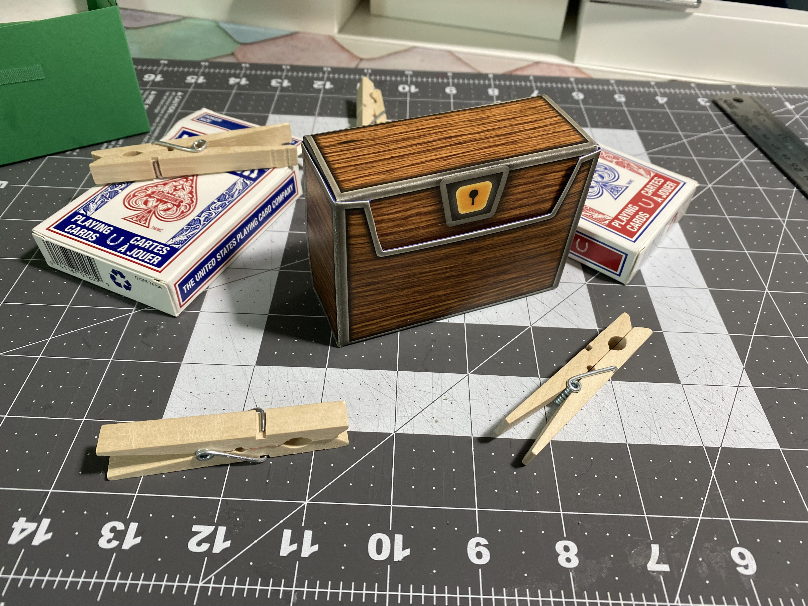
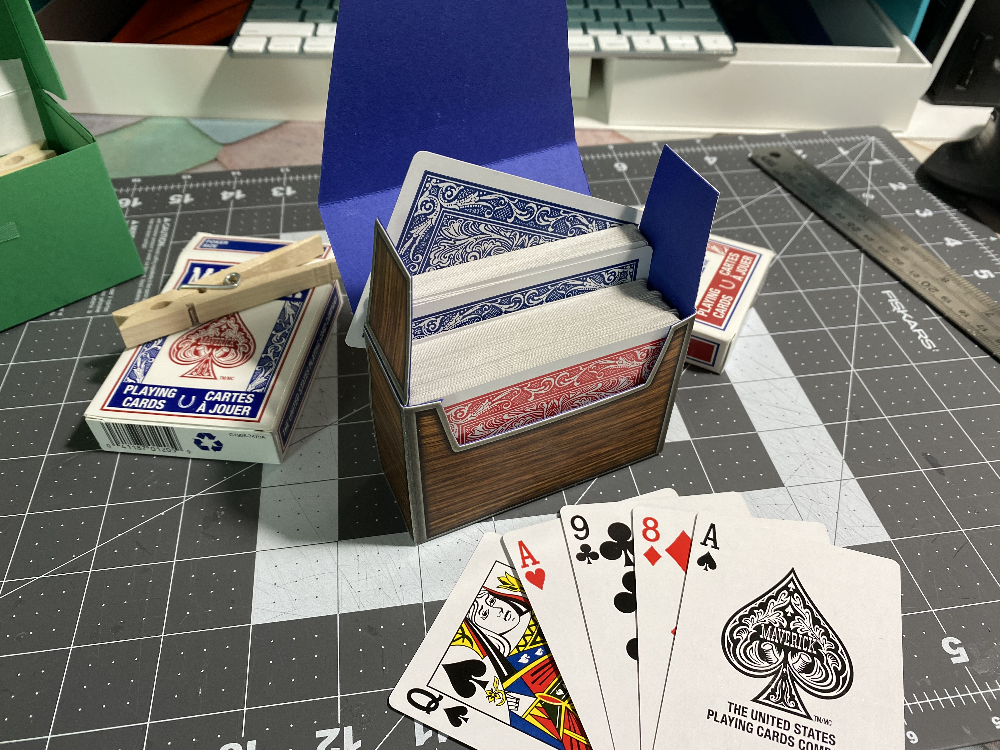
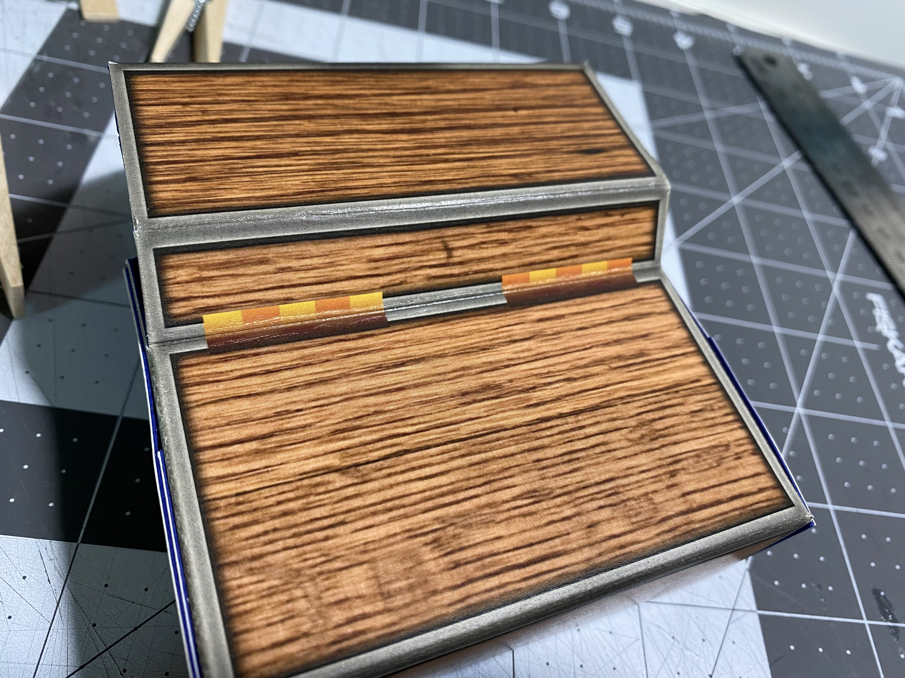

# Chest Deck Box

This was originally created to supplement the card game [Bargain Quest](http://bargainquestgame.com) to store the for-sale item cards, although it coincidentally holds two full 52-card poker decks.

The Wood texture used is a Creative-Commons-Attribution licensed image <https://flickr.com/photos/bittbox/3508894080> by Flickr user bittbox.

Originally this was conceived of as a typical tall card box, but the ample depth of the deck makes it opportune to a sideways TCG style deck box.

## Sample Photos

This specific iteration was printed on an HP m454dw Laser Printer, on [Rite in the Rain](https://www.riteintherain.com) orange tinted cardstock, with a generic brand blue interior cardstock (I believe over 110 lb), bonded with 3M Super 77 glue.

### Closed:

### Open:

### Detail on the "hinged" section:

